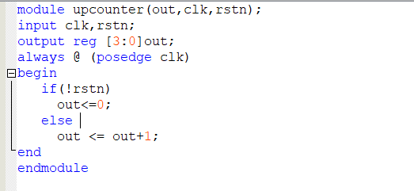

### SYNCHRONOUS-UP-COUNTER

## AIM:

To implement 4 bit synchronous up counter and validate functionality.

## SOFTWARE REQUIRED:

Quartus prime

## THEORY

## 4 bit synchronous UP Counter

If we enable each J-K flip-flop to toggle based on whether or not all preceding flip-flop outputs (Q) are “high,” we can obtain the same counting sequence as the asynchronous circuit without the ripple effect, since each flip-flop in this circuit will be clocked at exactly the same time:

Each flip-flop in this circuit will be clocked at exactly the same time.
The result is a four-bit synchronous “up” counter. Each of the higher-order flip-flops are made ready to toggle (both J and K inputs “high”) if the Q outputs of all previous flip-flops are “high.”
Otherwise, the J and K inputs for that flip-flop will both be “low,” placing it into the “latch” mode where it will maintain its present output state at the next clock pulse.
Since the first (LSB) flip-flop needs to toggle at every clock pulse, its J and K inputs are connected to Vcc or Vdd, where they will be “high” all the time.
The next flip-flop need only “recognize” that the first flip-flop’s Q output is high to be made ready to toggle, so no AND gate is needed.
However, the remaining flip-flops should be made ready to toggle only when all lower-order output bits are “high,” thus the need for AND gates.

## Procedure
1.Initialize the shift register to a known state (e.g., all zeros).

2.Input a bit serially into the shift register.

3.Shift the contents of the register one position to the right (or left).

4.Output the shifted bit from the last stage of the register.

5.Repeat steps 2-4 for each bit you want to input and shift.
## PROGRAM

/* Program for flipflops and verify its truth table in quartus using Verilog programming. 

Developed by:Sriram R
 RegisterNumber:212223230215
*/

## RTL LOGIC UP COUNTER

## TIMING DIAGRAM FOR IP COUNTER

## TRUTH TABLE

## RESULTS
Hence a 4 bit synchronous up counter is implemented correctly